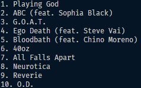
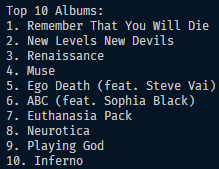

# Python Spotify API

    
    

This program is to test the Spotify API, and retrieval of data from it.

# Contribution 

If you'd like to contribute to `python_spotify_api` please submit a pull-request on a feature branch.

# Installing

Clone the repo:

    git clone https://github.com/Sommos/python_spotify_api

    cd python_spotify_api